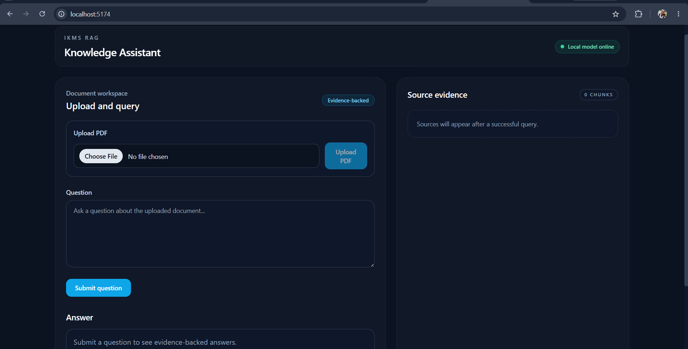
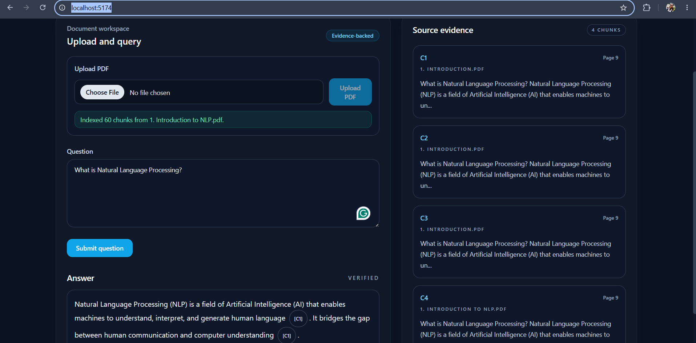

# IKMS RAG Citations

An evidence-aware Retrieval-Augmented Generation (RAG) application that allows users to upload PDF documents, ask questions, and receive AI-generated answers supported by relevant document evidence and citations.

**Live Demo:** https://ikms-rag-citations-s5x4.vercel.app/

**Backend API Documentation:** https://ikms-rag-citations-api.onrender.com/docs

 
 

## Features

- Upload PDF documents through a web interface.
- Extract and split document text into manageable chunks.
- Retrieve relevant content using semantic vector search.
- Generate context-aware answers using an LLM.
- Provide evidence-grounded responses with relevant citations and source snippets.
- Support cloud-based AI inference using Google Gemini.
- Store and retrieve document embeddings using Pinecone.
- Support local AI workflows using Ollama and FAISS, where configured.
- Provide an interactive frontend for document-based question answering.

## Tech Stack

### Backend
- Python
- FastAPI
- LangChain
- LangGraph

### Frontend
- React
- TypeScript
- Vite
- Tailwind CSS

### AI and Retrieval
- Google Gemini for cloud-based question answering
- Pinecone for vector storage and semantic retrieval
- Ollama for local LLM inference
- FAISS for local vector storage

### Deployment
- Vercel — frontend hosting
- Render — backend hosting

## System Architecture

The application follows a modular architecture that connects PDF processing, semantic retrieval, and AI-generated responses.

1. **Document Ingestion:** Users upload PDF documents through the frontend.
2. **Text Processing:** The backend extracts document text and splits it into chunks.
3. **Embedding and Indexing:** Text chunks are converted into embeddings and stored in the configured vector store.
4. **Semantic Retrieval:** Relevant chunks are retrieved based on the user's question.
5. **Answer Generation:** The configured language model generates an answer using the retrieved evidence.
6. **Citation Display:** The frontend displays the answer with supporting source information.

## Project Structure

```text
IKMS_RAG/
├── backend/
│   ├── src/
│   │   └── app/
│   ├── requirements.txt
│   └── pytest.ini
├── frontend/
│   ├── src/
│   ├── package.json
│   └── vite.config.ts
├── .env.example
├── .gitignore
├── requirements.txt
├── README.md
└── .faiss_store/
```

## Prerequisites

For local development, install:

- Python 3.11+
- Node.js 18+
- Git
- Ollama, if using the local inference configuration

For local Ollama mode, download the required models:

```bash
ollama pull gemma3:12b
ollama pull all-minilm
```

For cloud mode, configure the required Gemini and Pinecone credentials instead.

## Local Setup

### 1. Clone the repository

```bash
git clone https://github.com/sanjulaS23/ikms-rag-citations.git
cd ikms-rag-citations
```

### 2. Create a Python virtual environment

```bash
python -m venv .venv
```

Activate it on Windows:

```powershell
.venv\Scripts\Activate.ps1
```

### 3. Install Python dependencies

```bash
pip install -r requirements.txt
```

If running the backend from its own directory, use the backend requirements file when appropriate:

```bash
pip install -r backend/requirements.txt
```

### 4. Install frontend dependencies

```bash
cd frontend
npm install
cd ..
```

### 5. Configure environment variables

Create a local `.env` file from the example:

```powershell
Copy-Item .env.example .env
```

Configure the variables for your chosen execution mode.

**Local Ollama + FAISS mode:**

```env
OLLAMA_BASE_URL=http://localhost:11434
OLLAMA_MODEL=gemma3:12b
OLLAMA_EMBEDDING_MODEL=all-minilm
LOCAL_OLLAMA=true
VECTOR_DB=faiss
```

**Cloud Gemini + Pinecone mode:**

```env
GEMINI_API_KEY=your_gemini_api_key
PINECONE_API_KEY=your_pinecone_api_key
PINECONE_INDEX=your_pinecone_index
PINECONE_NAMESPACE=your_pinecone_namespace
LLM_MODEL=your_supported_gemini_model
LOCAL_OLLAMA=false
VECTOR_DB=pinecone
```

Replace the example values with your own configuration. Never commit `.env` or expose API keys in frontend code or public repositories.

Check `.env.example` and the application configuration for the exact variable names and defaults supported by your current version.

## Running the Application Locally

### Start the backend

From the repository root, open a terminal and run:

```powershell
cd backend
$env:PYTHONPATH="src"
python -m uvicorn app.main:app --host 0.0.0.0 --port 8000 --reload
```

Backend API documentation:

http://localhost:8000/docs

### Start the frontend

Open a second terminal:

```bash
cd frontend
npm run dev
```

Open the application at:

http://localhost:5173

## Usage

1. Open the web application.
2. Upload a PDF document.
3. Wait for the document to be processed and indexed.
4. Enter a question related to the uploaded content.
5. Review the generated answer.
6. Check the supporting citations and source snippets to verify the information.

## Deployment

The current application is deployed using:

- **Frontend:** Vercel
- **Backend:** Render
- **Language model:** Google Gemini
- **Vector database:** Pinecone

The frontend uses the `VITE_API_BASE_URL` environment variable to communicate with the deployed backend. The backend uses `FRONTEND_ORIGIN` to configure CORS for the deployed frontend.

Cloud deployments require the appropriate environment variables and credentials to be configured in the hosting platform.

## Important Notes

- The live deployment uses cloud services and may have free-tier usage limits or cold starts.
- Local Ollama and FAISS workflows depend on the local configuration and installed models.
- FAISS indexes are stored locally and are not automatically shared with the cloud deployment.
- Citation quality depends on document extraction, chunking, retrieval quality, and answer generation.
- Avoid uploading sensitive documents to a public demo.

## Future Improvements

- Improve citation accuracy and source verification.
- Add document management and deletion controls.
- Introduce user authentication and isolated document collections.
- Add evaluation metrics for retrieval relevance and answer faithfulness.
- Improve handling of large PDFs and concurrent requests.

## License

This project is licensed under the MIT License.

